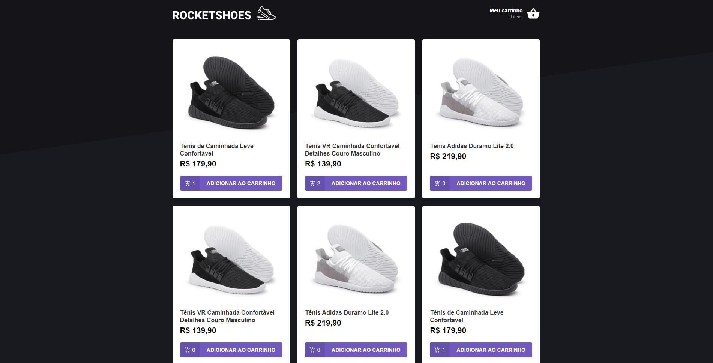
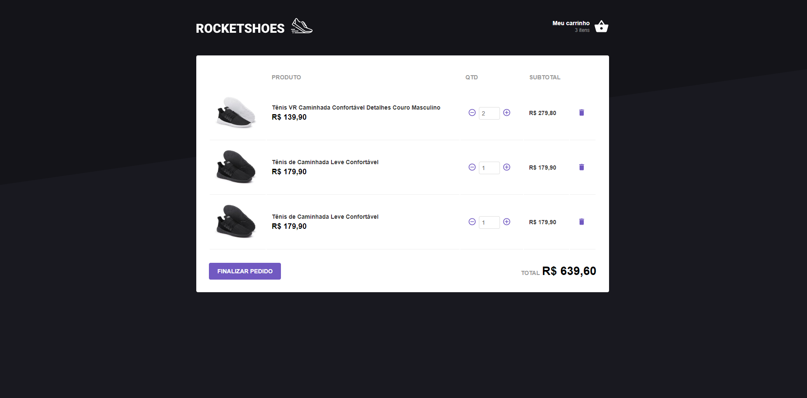

<h1 align="center">Rocketshoes</h1>
<h3 align="center">⚡ A React project with Redux and Redux Saga ⚡</h3>
<br />

## Screenshots
<p align="center">
  
  
</p>


## About
<p align="left">
  This project was developed during the Rocketseat Bootcamp. Where I learned in practice Redux, Redux Saga and other technologies.
</p>

<br />

## How to run 🔥

```bash
# Clone this repository
$ git clone https://github.com/hrammos/rocketshoes.git

# Go into the repository
$ cd rocketshoes

# Install dependencies
$ yarn install

# Run server
$ yarn server

# Run web application
$ yarn start
```
###### *This project runs with a fake API, from [json-server](https://github.com/typicode/json-server).*

<br />

-------
#### By [Henrique Ramos](https://www.linkedin.com/in/henriqueoramos) 👋
